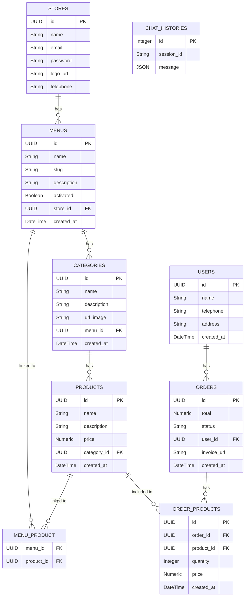

```mermaid
erDiagram
    USERS {
        UUID id PK
        String name
        String telephone
        String address
        DateTime created_at
    }

    STORES {
        UUID id PK
        String name
        String email
        String password
        String logo_url
        String telephone
    }

    MENUS {
        UUID id PK
        String name
        String slug
        String description
        Boolean activated
        UUID store_id FK
        DateTime created_at
    }

    CATEGORIES {
        UUID id PK
        String name
        String description
        String url_image
        UUID menu_id FK
        DateTime created_at
    }

    PRODUCTS {
        UUID id PK
        String name
        String description
        Numeric price
        UUID category_id FK
        DateTime created_at
    }

    ORDERS {
        UUID id PK
        Numeric total
        String status
        UUID user_id FK
        String invoice_url
        DateTime created_at
    }

    ORDER_PRODUCTS {
        UUID id PK
        UUID order_id FK
        UUID product_id FK
        Integer quantity
        Numeric price
        DateTime created_at
    }

    CHAT_HISTORIES {
        Integer id PK
        String session_id
        JSON message
    }

    MENU_PRODUCT {
        UUID menu_id FK
        UUID product_id FK
    }

    %% Relacionamentos
    USERS ||--o{ ORDERS : "has"
    STORES ||--o{ MENUS : "has"
    MENUS ||--o{ CATEGORIES : "has"
    CATEGORIES ||--o{ PRODUCTS : "has"
    MENUS ||--o{ MENU_PRODUCT : "linked to"
    PRODUCTS ||--o{ MENU_PRODUCT : "linked to"
    PRODUCTS ||--o{ ORDER_PRODUCTS : "included in"
    ORDERS ||--o{ ORDER_PRODUCTS : "has"
```